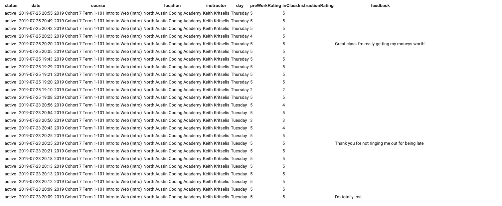



# Instructor Support: Process

## The Tools and Techniques We use to Support Instructors

### End of Class Feedback & Attendance Code

At the end of every class, students are given the daily attendance code to check in for the class. Before they submit the code they are asked to rate the **In-class Instruction** and **Pre-Homework** on a 1-5 star scale along with the option to give comments about how the class went are how they're doing in class. 

Every Friday, these rating and comments are collected into an email and sent to each Instructor, the Campus Director, CEO, and Curriculum Director. 

    
### End Of Course Evaluations

On the last day of each course students are asked to respond to the [End of Course Evaluation](https://forms.gle/y1yyCUyRQ1M2ZfoUA). The feedback of this evaluation is shared with the Campus Director, Instructor, and CEO.

### Continuous Instructor Feedback

It's hard to observe ourselves and be in the moment. Instructors are asked to be in class with the students and teach the lesson for the day. But we also want them to continuously improve in their skills and methods to engage students in effective learning. 

To help our Instructors constantly improve, the Campus Director will work with them in class through observation, notes taking, and reflective meetings. While these observations are formal and recorded, the intention behind them is honest and genuine, help Instructors become more effective in the classroom so that our students gain the most and become more confident every day they're with the Instructor.

<!-- @TODO Daniel Mutter: added in link to document used for formal observations. -->

While the formal document to record notes for each Instructor is [here](google.com) take some time to walk through each of these observation points:

#### Class Structure

Class structure is important to keep students engaged and learning. Also, it's important that Instructors are giving students plenty of time to work on projects in class for support. 
* Beginning of Class Instruction: 
    * Presentations: Giving students who are presenting extra encouragement
    * Whiteboarding: Participate and helping students as needed; Are students leading the discussion or is the Instructor? The students should be participating just as much or more than the Instructor.
* Middle of Class Instruction:
    * Q&A: Is the Instructor opening it up for students to feel comfortable asking questions? Is the Instructor answering the questions? Are they ending questions at a reasonable time?
* In-Class Projects: **MUST START AT 7:30** to give students time to work in class; encourage Instructors to not lecture after the project has been reviewed.
    
#### *Goal Setting*
<!-- @TODO @DANIEL -->

### *New Instructor Training and Feedback Program*
* Coming soon!

## Quiz Time

Before moving on: Take the [Instructor Support Quiz]()

## Go to [Facility Information](../steps/facilityInformation.md)

******
******


