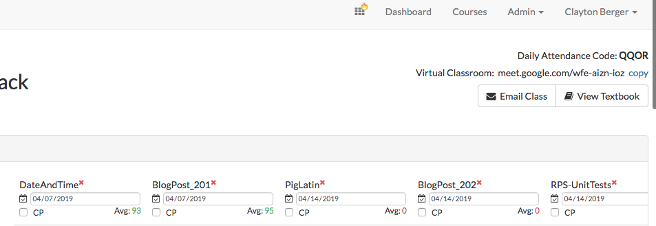



# On-the-Job Duties

* **Communication 1/7**
  * ACA uses our in-house management system [Campus Manager](https://campus.austincodingacademy.com/#users/5b43b1b15ca8d30014dddfa9) to manage classes, students, instructors, textbooks, attendance and grades. Check your email to get your invitation in sign-in.
  * ACA employs recent graduates a [tutors](https://austincodingacademy.com/tutors/) to help student outside of class. You can guide student to find tutors from Campus Manager by clicking on the waffle icon at the top.
  * Also from the waffle icon you can find ACA's [Calendar](https://calendar.austincodingacademy.com/) of events.
  * As you saw in the previous section, your class has it's own Textbook. This can be thought of as a single source of truth for the students and Instructor.
  * The Student Handbook can also be found through the waffle icon at the top of Campus Manager
  * Like Slack, we use [rocketChat](https://chat.austincodingacademy.com/) to maintain a single platform of communications. This should be treated as any chat platform at work. Make sure you and your students are using it.
  * Instead of shoving newbie developers into Stack Overflow we developed a forum call [HackOver Flow](https://austincodingacademy.com/forum/) that helps students find solutions faster while still training them to search.
  * Finally, your ACA email is your official means of communication with ACA staff. If you are to communicate outside of rocketChat, please make sure you are using your ACA email.

******

* **Study for yourself and follow the curriculum 2/7**
  * While you are a talented developer and have every right to every opinion. The fact remains that each of your students are also our customer. They are a customer that has paid money and invested time in study and driving to class to learn a new skill set. In order to maintain their confidence and to grow them to be stronger developers you need to follow the textbook and not different from it.
  * To do this, read through the pre-homework and plan for the lesson ahead.
  * If you have any recommendations or concerns please send them to your Academic Manager.
  * Remember, your students are also your customers, they’ve paid to get material to study and to learn from a developer in tandem. Do NOT diverge from the curriculum.

******

* **Prep Every Class Day 3/7**
    * Get to class early
    * Get small whiteboards out
    * Set up projector and connect your computer
    * Stand ready and available for students to approach with questions
    * Prep yourself for whiteboard training and Homework Q/As
    * Make sure you clearly understand class day goal

******

* **Record every class 4/7**
  * **Using the Google Meet code at the top-right of Campus Manager you will record every class from beginning to end.**

  

  * If you use the code, sign-into your ACA account and record the class on the day of class, the video will be uploaded to our drive and linked to Campus Manger so all students have nearly immediate access to the recording.
  * Every class, record every minute.

******

* **Post Assignments and Grading 5/7**
  * Organized instruction provides safety and predictability to students. To do this, post each assignment the day it is assigned. 
    * This included Daily Projects, Blogs, and Checkpoints
  * Daily vs Checkpoint - know the difference
    * Daily grades are blogs and Daily Projects
    * Checkpoints(cp) - are like exams, they test the students' understanding of previously covered concepts and are weighted at twice the value of daily grades.
  * Due on Sunday -  All assignments, including blogs and checkpoints should be due on Sunday.
    * Again, predictability build confidence in the student and you.
    * Giving the students the weekend to finish all assignments and time to meet with a tutor will boost their performance and expectations.
  * Grading assignment with detailed comments
    * While grades are not what will get students jobs they still want to know how they are doing. Everyone wants feedback. That's what error messages are after all.
    * Please grade assignments promptly and offer quality comments that will help students learn to code better.  
    * While blogs are not the priority, spend a bit of time every once in a while reading what your students write. You may be surprised at how and what they learn.

******

* **Attendance 6/7**
  * ACA keeps track of student attendance by matching an auto-generated code for each day.
  * Ten minutes before the end of class you will share with the students the attendance code show to you at the top-right of Campus Manager.
  * The window the student see to check-in request that they rate the pre-homework and instruction on a 5-star rating system as well as provide an *optional* comment before entering the code.

******

* **Locking Up 7/7**
  * While your location may vary from others, it is important that you shut and lock your classroom door as you leave.
  * Be sure to also shut down computers and projectors before leaving.

******

## Quiz

Before heading out, be sure to take the [quiz on Day to Day Procedures](https://docs.google.com/forms/d/e/1FAIpQLSfYmvAgiRy2_Oovi-kOq7Sq1DwSF4qd2ZEqmhNvApdeo9Qpew/viewform?usp=sf_link)!

## Go to [Human Resources](humanResources.md)


